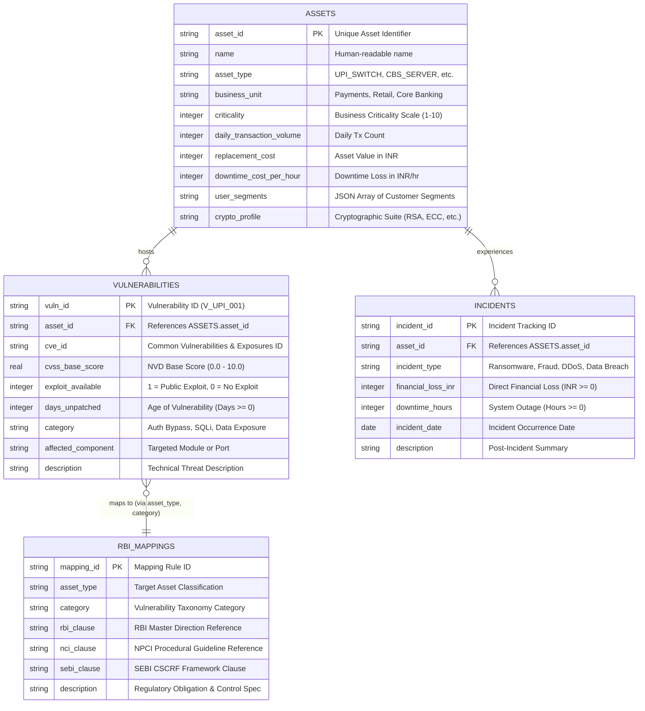

# CyberLens 2.0 — Data Architecture & Regulatory Data Model (DATA_MODEL.md)

**Smart India Hackathon (SIH) 2026** | **Problem Statement**: Quantitative Cyber Risk Assessment & Multi-Regulatory Compliance for Indian Banking Infrastructure  
**Author**: Data & Compliance Lead  
**Database Engine**: SQLite (Embedded/Zero-Setup Demo) | Fully compatible with PostgreSQL, CockroachDB, Oracle Database

---

## 1. Executive Summary & Architectural Overview

CyberLens 2.0 bridges the gap between **technical cybersecurity telemetry** (CVEs, CVSS scores, exploit indicators) and **financial risk governance / regulatory compliance** (RBI, NPCI, SEBI, CERT-In). 

The underlying data model is structured in **Third Normal Form (3NF)** to ensure zero data redundancy, strict referential integrity, and sub-millisecond query execution during real-time Monte Carlo simulations and budget optimizations.

```
+-------------------+        1 : N         +----------------------+
|      assets       | -------------------> |   vulnerabilities    |
| (Banking Systems) |                      | (Discovered Threats) |
+-------------------+                      +----------------------+
        | 1                                           | N
        |                                             |
        | 1 : N                                       | (asset_type, category)
        v                                             v
+-------------------+                      +----------------------+
|     incidents     |                      |     rbi_mappings     |
| (Historical Loss) |                      | (Regulatory Clauses) |
+-------------------+                      +----------------------+
```

---

## 2. Entity-Relationship Diagram (Mermaid)



---

## 3. Data Dictionary & Table Specifications

### 3.1 `assets` — Banking Infrastructure Inventory

Master catalog of core banking servers, switch interfaces, customer portals, and cryptographic modules.

| Column | Type | Constraints | Description & Business Purpose |
| :--- | :--- | :--- | :--- |
| `asset_id` | `TEXT` | `PRIMARY KEY` | Unique asset code (e.g. `UPI_SWITCH_001`, `CBS_SERVER_001`). |
| `name` | `TEXT` | `NOT NULL` | Formal asset designation (e.g., `NPCI UPI Switch Core`). |
| `asset_type` | `TEXT` | `NOT NULL` | Architectural tier (`UPI_SWITCH`, `CBS_SERVER`, `MOBILE_BANKING_APP`, `ATM_SWITCH`, `WEB_BANKING_PORTAL`, `USSD_GATEWAY`, `API_GATEWAY`, `DATABASE`, `AUTH_SERVER`, `LOG_SERVER`). |
| `business_unit` | `TEXT` | `NOT NULL` | Owning division (`Digital Payments`, `Core Banking`, `Channels`, `Treasury & Markets`, `Enterprise Security`). |
| `criticality` | `INTEGER` | `NOT NULL`, `CHECK (1..10)` | Systemic criticality score. Level 10 = Systemically Important Payment Infrastructure (SIPI). |
| `daily_transaction_volume` | `INTEGER` | `NOT NULL`, `CHECK (>= 0)` | Daily financial transactions processed. Used for risk exposure scaling. |
| `replacement_cost` | `INTEGER` | `NOT NULL`, `CHECK (>= 0)` | Hardware, licensing, and deployment cost to reconstitute asset in ₹ INR. |
| `downtime_cost_per_hour` | `INTEGER` | `NOT NULL`, `CHECK (>= 0)` | Business loss per hour of outage (lost interchange fee, SLA penalties, customer churn) in ₹ INR. |
| `user_segments` | `TEXT` | `NULL` | JSON array of impacted customer demographics (e.g. `["RETAIL", "MERCHANT", "JAN_DHAN", "CORPORATE"]`). |
| `crypto_profile` | `TEXT` | `NULL` | Cryptographic algorithm deployed (e.g. `RSA-2048`, `RSA-1024`, `ECC-256`, `3DES`). Feeds the Quantum Risk Engine. |

---

### 3.2 `vulnerabilities` — Discovered Technical Vulnerabilities

Catalog of active security defects, vulnerability scans, penetration test findings, and threat intelligence.

| Column | Type | Constraints | Description & Business Purpose |
| :--- | :--- | :--- | :--- |
| `vuln_id` | `TEXT` | `PRIMARY KEY` | Unique vulnerability identifier (e.g. `V_UPI_001`). |
| `asset_id` | `TEXT` | `NOT NULL`, `FK -> assets(asset_id)` | Foreign key linking threat to host asset. `ON DELETE CASCADE`. |
| `cve_id` | `TEXT` | `NULL` | MITRE / NVD standard identifier (e.g. `CVE-2024-21413`). |
| `cvss_base_score` | `REAL` | `NOT NULL`, `CHECK (0.0..10.0)` | Standard CVSS v3.1 base score (Exploitability + Impact). |
| `exploit_available` | `INTEGER` | `NOT NULL`, `CHECK (0, 1)` | `1` = Weaponized public exploit exists in Metasploit/Exploit-DB; `0` = Theoretical only. Multiplies risk by `1.5x`. |
| `days_unpatched` | `INTEGER` | `NOT NULL`, `CHECK (>= 0)` | Elapsed days since CVE publication or patch release without remediation. |
| `category` | `TEXT` | `NOT NULL` | Standardized vulnerability taxonomy (`Authentication Bypass`, `Data Exposure`, `SQL Injection`, `Privilege Escalation`, `Insecure Storage`, `Input Validation`, `Network Sniffing`, `Session Fixation`, `Cross-Site Scripting`, `Injection`, `Rate Limiting`, `Weak Cryptography`). |
| `affected_component` | `TEXT` | `NULL` | Specific microservice, URI endpoint, daemon, or database table affected. |
| `description` | `TEXT` | `NULL` | Technical breakdown of vulnerability mechanics and impact. |

---

### 3.3 `incidents` — Historical Breach & Loss Records

Historical cyber incident repository used for Bayesian likelihood calibration and insurance loss calculations.

| Column | Type | Constraints | Description & Business Purpose |
| :--- | :--- | :--- | :--- |
| `incident_id` | `TEXT` | `PRIMARY KEY` | Incident tracking number (e.g. `INC_2023_001`). |
| `asset_id` | `TEXT` | `NOT NULL`, `FK -> assets(asset_id)` | Foreign key linking historical incident to the affected asset. |
| `incident_type` | `TEXT` | `NOT NULL` | Incident classification (`Credential Stuffing`, `SQL Injection Data Exfiltration`, `SMS Gateway Hijack / SIM Swap`, `ATM Black-box Jackpotting Attack`, `Ransomware Double Extortion`). |
| `financial_loss_inr` | `INTEGER` | `NOT NULL`, `CHECK (>= 0)` | Direct monetary loss in ₹ INR (fraud restitution, fines, forensics). |
| `downtime_hours` | `INTEGER` | `NOT NULL`, `CHECK (>= 0)` | Total operational outage duration in hours. |
| `incident_date` | `DATE` | `NOT NULL` | ISO 8601 date (`YYYY-MM-DD`) when the incident was detected. |
| `description` | `TEXT` | `NULL` | Post-incident root cause analysis (RCA) and mitigation summary. |

---

### 3.4 `rbi_mappings` — Indian Multi-Regulatory Compliance Crosswalk

Maps technical vulnerability classifications to Indian statutory regulations and standards.

| Column | Type | Constraints | Description & Regulatory Framework |
| :--- | :--- | :--- | :--- |
| `mapping_id` | `TEXT` | `PRIMARY KEY` | Unique rule mapping key (e.g. `RMAP_001`). |
| `asset_type` | `TEXT` | `NOT NULL` | Architectural tier matching `assets.asset_type`. |
| `category` | `TEXT` | `NOT NULL` | Threat taxonomy matching `vulnerabilities.category`. |
| `rbi_clause` | `TEXT` | `NULL` | **Reserve Bank of India (RBI)** mandate (e.g., Master Direction on Digital Payment Security Controls 2021, Cyber Security Framework in Banks 2016). |
| `nci_clause` | `TEXT` | `NULL` | **National Payments Corporation of India (NPCI)** operational guidelines (UPI Procedural Guidelines OC-87, NFS ATM Security Circulars, NUUP specifications). |
| `sebi_clause` | `TEXT` | `NULL` | **Securities & Exchange Board of India (SEBI)** Cybersecurity & Cyber Resilience Framework (CSCRF 2024). |
| `description` | `TEXT` | `NULL` | Plain-English summary of mandatory controls required by regulators. |

> **Unique Integrity Constraint**: `UNIQUE(asset_type, category)` guarantees 1:1 deterministic mapping for automated audit reporting.

---

## 4. Quantitative Risk Engine Mathematical Integration

The tables in this data model directly feed the CyberLens 2.0 quantitative algorithms:

### 4.1 RBI-Weighted CVSS
$$\text{RBI-CVSS} = \min\left(10.0, \text{CVSS}_{\text{base}} \times M_{\text{cat}} \times M_{\text{exploit}} \times M_{\text{age}} \times M_{\text{crypto}}\right)$$

* Where $M_{\text{cat}}$ is determined by asset criticality ($1.0 + (\text{criticality} \times 0.06)$).
* $M_{\text{exploit}} = 1.5$ if `exploit_available = 1` else $1.0$.
* $M_{\text{age}} = 1.0 + \min(0.3, \text{days\_unpatched} / 100)$.
* $M_{\text{crypto}} = 1.2$ if `crypto_profile` is flagged as vulnerable to Shor's algorithm (e.g. `RSA-1024`, `3DES`).

### 4.2 Expected Annual Loss (EAL in ₹)
$$\text{EAL} = \text{Single Loss Expectancy (SLE)} \times \text{Annualized Rate of Occurrence (ARO)}$$
$$\text{SLE} = (\text{downtime\_cost\_per\_hour} \times T_{\text{outage}}) + (\text{daily\_transaction\_volume} \times \text{AvgTxValue} \times P_{\text{fraud}}) + \text{Fines}_{\text{RBI}}$$

---

## 5. Performance Indexes & Query Optimization

To guarantee sub-second execution on high-throughput banking systems, the following B-Tree indexes are enforced:

```sql
CREATE INDEX IF NOT EXISTS idx_assets_asset_type ON assets(asset_type);
CREATE INDEX IF NOT EXISTS idx_assets_business_unit ON assets(business_unit);
CREATE INDEX IF NOT EXISTS idx_vulnerabilities_asset_id ON vulnerabilities(asset_id);
CREATE INDEX IF NOT EXISTS idx_vulnerabilities_category ON vulnerabilities(category);
CREATE INDEX IF NOT EXISTS idx_incidents_asset_id ON incidents(asset_id);
CREATE INDEX IF NOT EXISTS idx_rbi_mappings_asset_category ON rbi_mappings(asset_type, category);
```

---

## 6. SQL Query Cookbook for SIH 2026 Judges

### Query 1: Top 5 Highest-Risk UPI & Payment Assets with Unpatched Vulnerabilities
```sql
SELECT 
    a.asset_id,
    a.name,
    a.criticality,
    a.daily_transaction_volume,
    v.vuln_id,
    v.cve_id,
    v.cvss_base_score,
    v.days_unpatched,
    r.rbi_clause,
    r.nci_clause
FROM assets a
JOIN vulnerabilities v ON a.asset_id = v.asset_id
LEFT JOIN rbi_mappings r ON a.asset_type = r.asset_type AND v.category = r.category
WHERE a.asset_type IN ('UPI_SWITCH', 'API_GATEWAY', 'MOBILE_BANKING_APP')
ORDER BY v.cvss_base_score DESC, v.days_unpatched DESC
LIMIT 5;
```

### Query 2: Regulatory Compliance Gap Analysis Across RBI, NPCI, and SEBI
```sql
SELECT 
    v.vuln_id,
    a.name AS asset_name,
    a.asset_type,
    v.category,
    COALESCE(r.rbi_clause, 'VIOLATION: Missing RBI Mapping') AS rbi_status,
    COALESCE(r.nci_clause, 'VIOLATION: Missing NPCI Mapping') AS npci_status,
    COALESCE(r.sebi_clause, 'VIOLATION: Missing SEBI Mapping') AS sebi_status
FROM vulnerabilities v
JOIN assets a ON v.asset_id = a.asset_id
LEFT JOIN rbi_mappings r ON a.asset_type = r.asset_type AND v.category = r.category;
```

### Query 3: Cumulative Financial Loss & Downtime by Asset Type
```sql
SELECT 
    a.asset_type,
    COUNT(i.incident_id) AS total_incidents,
    SUM(i.financial_loss_inr) AS total_loss_inr,
    SUM(i.downtime_hours) AS total_downtime_hours,
    ROUND(AVG(i.financial_loss_inr), 2) AS avg_loss_per_incident_inr
FROM assets a
LEFT JOIN incidents i ON a.asset_id = i.asset_id
GROUP BY a.asset_type
HAVING total_incidents > 0
ORDER BY total_loss_inr DESC;
```

---

## 7. Production Migration Guide (PostgreSQL / Enterprise SQL)

For production deployment in a Scheduled Commercial Bank (SCB), the schema transitions directly to PostgreSQL:

```sql
-- PostgreSQL Production DDL Migration
CREATE TYPE asset_type_enum AS ENUM (
    'UPI_SWITCH', 'CBS_SERVER', 'MOBILE_BANKING_APP', 'ATM_SWITCH',
    'WEB_BANKING_PORTAL', 'USSD_GATEWAY', 'API_GATEWAY', 'DATABASE',
    'AUTH_SERVER', 'LOG_SERVER'
);

CREATE TABLE assets (
    asset_id VARCHAR(64) PRIMARY KEY,
    name VARCHAR(255) NOT NULL,
    asset_type asset_type_enum NOT NULL,
    business_unit VARCHAR(128) NOT NULL,
    criticality SMALLINT NOT NULL CHECK (criticality BETWEEN 1 AND 10),
    daily_transaction_volume BIGINT NOT NULL CHECK (daily_transaction_volume >= 0),
    replacement_cost BIGINT NOT NULL CHECK (replacement_cost >= 0),
    downtime_cost_per_hour BIGINT NOT NULL CHECK (downtime_cost_per_hour >= 0),
    user_segments JSONB DEFAULT '[]'::jsonb,
    crypto_profile VARCHAR(64),
    created_at TIMESTAMPTZ DEFAULT CURRENT_TIMESTAMP,
    updated_at TIMESTAMPTZ DEFAULT CURRENT_TIMESTAMP
);
```

---
*Co-Authored-By: Claude Code <noreply@anthropic.com>*